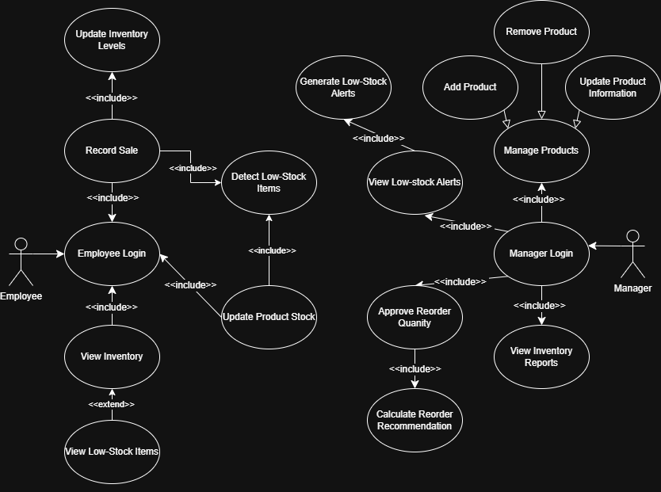

# Inventory Management System

An **Inventory Management System** designed to help **small and medium-sized businesses** track product stock, record sales, and prevent inventory shortages. The system uses **role-based access control** to separate employee operations from managerial decision-making while providing automated **low-stock alerts** and **reorder recommendations**.

## Overview

The Inventory Management System is a **web-based application** that replaces manual inventory tracking and spreadsheet-based workflows with an automated platform. All users must authenticate before accessing the system, and functionality is divided between **Employees** and **Managers** based on role permissions.

Employees handle daily inventory operations such as recording sales and updating stock levels, while managers oversee product management, inventory reports, and reorder approvals. The system continuously monitors inventory changes, detects low-stock conditions, and generates alerts with data-driven reorder recommendations to ensure accurate and reliable inventory control.

The system’s functionality and actor interactions are documented using UML use-case modeling, as shown below:

## Features

- Secure login system with **role-based access control**
- Two user roles:
  - **Employees**: record sales and update stock levels
  - **Managers**: manage products, view reports, and approve reorders
- Product catalog management:
  - Add, update, and remove products (manager-only)
- Real-time inventory tracking with automatic stock updates
- Low-stock detection using predefined thresholds
- Automated **low-stock alerts** for managers
- **Reorder quantity recommendations** based on historical sales data
- Inventory and sales reports for trend analysis
- Continuous background processing to maintain accurate inventory data

## Modules

- **Authentication Module**
  - Handles employee and manager login
  - Validates credentials and enforces role-based access control
  - Required for all system operations

- **Product Management Module (Manager)**
  - Adds new products to the system
  - Updates product information such as name, category, price, and stock
  - Removes products from the inventory database

- **Inventory Operations Module (Employee)**
  - Records sales and updates inventory levels
  - Allows stock adjustments when inventory changes
  - Ensures real-time accuracy of product quantities

- **Inventory Monitoring Module**
  - Updates inventory levels after stock changes
  - Detects low-stock items based on thresholds
  - Flags products for alerts and reporting

- **Alerts & Reorder Module**
  - Generates low-stock alerts for managers
  - Calculates reorder quantity recommendations using sales history
  - Allows managers to approve or modify reorder decisions
  - Tracks approved reorders for future analysis

- **Reporting Module**
  - Produces inventory and sales reports
  - Summarizes stock levels and sales trends
  - Supports extended views such as low-stock alerts
 
## Currently Implemented

The current prototype focuses on demonstrating core system functionality and required web technologies for the lab:

- Login page with **employee authentication**
- Session handling for logged-in users
- Recording sales for inventory items
- Updating stock levels by:
  - Removing stock when a sale is recorded
  - Adding stock manually
- Inventory operations are demonstrated using **one static product**, sufficient for validating system logic and servlet–JSP communication in the prototype phase

## Features to Be Added & Known Issues

### Planned Features
1. Add visual styling to improve the user interface and usability.
2. Replace the single static product with a selectable list of products for recording sales and updating stock (not required for the current prototype).
3. Base stock updates on an internal inventory data structure rather than hardcoded values (not required for the current prototype).

### Known Issues / Limitations
1. When stock reaches zero, the system currently displays a **low-stock warning** instead of a distinct **out-of-stock** message.
2. The system does not currently warn users when attempting to remove more stock than is available.
3. Inventory quantities are simplified for demonstration purposes and do not yet reflect a fully dynamic backend inventory model.
